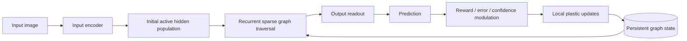
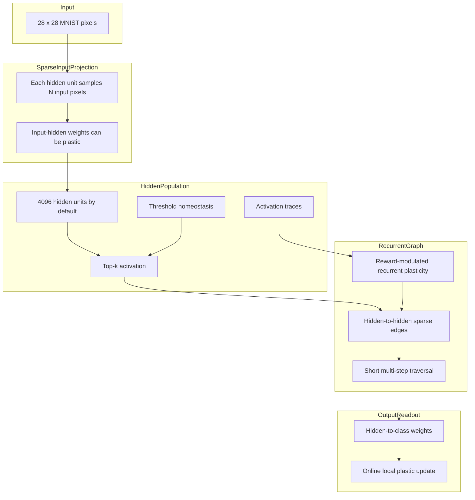

# Persistent Plastic Graph MNIST Experiments

This project is a small experimental framework for testing a biologically inspired learning-machine idea:

> Instead of treating a model as a dense static sea of matrices, treat it as a sparse persistent graph of adaptive units whose active pathways can be reinforced, weakened, and inspected over time.

This is **not** intended to beat CNNs on MNIST. MNIST is used because it gives us a clean, cheap proving ground for the learning dynamics.

## The central question

Can a small sparse graph substrate learn useful behavior through online reward-modulated plasticity?

More specifically, can it:

1. Activate only a small subset of units per example.
2. Learn from immediate `yes/no` correction.
3. Strengthen useful active pathways.
4. Avoid runaway collapse through threshold homeostasis.
5. Use recurrent hidden-to-hidden traversal in a way that improves generalization or learning speed.
6. Persist its evolving state for inspection.

## Typical neural network vs this experiment

### Conventional dense training loop


A conventional model usually treats inference and learning as separate phases. The model is trained by global gradient descent. During inference, parameters are usually frozen.

### Plastic graph traversal loop



This model makes a prediction, receives feedback, then updates only the participated pathways. It uses local eligibility-like traces and modulatory signals rather than full backpropagation through a dense model.

## Current architecture



## What changed in this iteration

This version adds the next experiment we discussed:

- hidden-to-hidden recurrent sparse edges;
- short recurrent traversal before output readout;
- recurrent eligibility-style plasticity;
- controlled ablation experiments;
- suite-level analysis comparing variants;
- extra metrics for recurrent drive and active population recruitment.

## Installation

```bash
python -m venv .venv
source .venv/bin/activate  # Windows: .venv\Scripts\activate
pip install -r requirements.txt
```

```powershell
python -m venv ..\.venv
..\.venv\Scripts\Activate.ps1
pip install -r requirements.txt
```

## Run one experiment

```bash
python run_mnist_experiment.py \
  --epochs 3 \
  --hidden-units 4096 \
  --active-hidden 128 \
  --input-edges-per-hidden 64 \
  --use-recurrence \
  --hidden-recurrent-edges-per-hidden 16 \
  --recurrent-steps 2 \
  --max-train 10000 \
  --max-test 2000
```

Then analyze the latest run:

```bash
python analyze_results.py \
  --db runs/plastic_graph_mnist.sqlite3 \
  --output-dir analysis/latest
```

## Run the controlled experiment suite

```bash
python run_experiment_suite.py \
  --epochs 3 \
  --hidden-units 4096 \
  --active-hidden 128 \
  --input-edges-per-hidden 64 \
  --max-train 10000 \
  --max-test 2000
```

Then compare all runs:

```bash
python analyze_experiment_suite.py \
  --db runs/plastic_graph_suite.sqlite3 \
  --output-dir analysis/suite
```

The suite runs these variants:

| Variant | Purpose |
|---|---|
| `full_recurrent_plastic_graph` | Main hypothesis: recurrent graph traversal plus traces, thresholds, input plasticity, and reward gating. |
| `no_recurrence_sparse_plastic_readout` | Control: previous-style sparse plastic classifier without hidden-to-hidden traversal. |
| `frozen_input_projection` | Tests whether input-side plasticity contributes beyond random features. |
| `no_homeostasis` | Tests whether thresholds prevent active population collapse. |
| `no_reward_modulation` | Tests whether confidence/novelty/reward gates matter. |

## Analytical framework

Do not judge this model only by final MNIST accuracy. A small CNN will crush it. The question is whether the biological-style mechanisms contribute in measurable ways.

### Primary performance metrics

| Metric | Meaning |
|---|---|
| `test/accuracy` | Does the learned substrate generalize? |
| `train/window_accuracy` | Is the model improving on the stream it sees? |
| train/test gap | Does it over-specialize to the online stream? |
| `average_confidence` | Is confidence rising with correctness or becoming pathological? |

### Plastic-graph mechanism metrics

| Metric | Meaning |
|---|---|
| `average_unique_active` | Number of unique hidden units recruited across traversal. Should exceed `active_hidden` when recurrence actually recruits new units. |
| `average_recurrent_drive_norm` | Magnitude of hidden-to-hidden contribution. If near zero, recurrence is present but functionally irrelevant. |
| checkpoint `hidden_thresholds` | Shows whether homeostasis is differentiating active populations. |
| checkpoint `hidden_traces` | Shows whether activity history is distributed or collapsed. |
| checkpoint `recurrent_weights` | Shows whether hidden-to-hidden pathways are changing. |

### Hypotheses

The thesis gains support if:

1. The recurrent model beats the no-recurrence control, learns faster, or reaches similar accuracy with fewer active units.
2. The recurrent model shows non-trivial recurrent drive and active-population recruitment.
3. Removing homeostasis worsens collapse, accuracy, or generalization.
4. Freezing input projection worsens performance, suggesting local input plasticity matters.
5. Removing reward modulation worsens stability or causes overconfidence.

The thesis is weakened if:

1. The no-recurrence control performs the same as the full recurrent model.
2. Recurrent drive remains near zero.
3. Unique-active recruitment does not increase with recurrent steps.
4. All ablations perform similarly, suggesting the system is mostly a shallow random-feature classifier.

## Project structure

```text
plastic_graph_mnist/
  run_mnist_experiment.py       # Run one configured experiment
  run_experiment_suite.py       # Run controlled ablation suite
  analyze_results.py            # Analyze one run
  analyze_experiment_suite.py   # Compare variants
  plastic_graph_mnist/
    config.py                   # ExperimentConfig
    data.py                     # MNIST loading
    logging_utils.py            # Logging setup
    modulators.py               # Reward/confidence/novelty modulation
    plastic_graph.py            # Sparse graph substrate
    storage.py                  # SQLAlchemy/SQLite persistence
    trainer.py                  # Online training loop
```

## Important caveat

This is still not a full biological learning machine. It is a bridge experiment. The current model is closer to:

```text
sparse sensory projection
+ top-k hidden activation
+ short recurrent traversal
+ plastic output readout
+ reward-modulated local updates
```

The next major frontier after this is to make tasks that truly require multi-step internal traversal, such as sequence reasoning, addition-as-successor traversal, maze/path problems, or compositional symbolic tasks.

---

# Experiment 4: Successor Traversal

The MNIST recurrent suite showed that recurrence was measurable but not yet clearly useful. Experiment 4 introduces a task that actually requires graph traversal: learning the successor relation and composing it to solve small addition problems.

See [`EXPERIMENT_4_SUCCESSOR_TRAVERSAL.md`](EXPERIMENT_4_SUCCESSOR_TRAVERSAL.md) for the full design and interpretation framework.

Quick run:

```bash
python run_exp4_suite.py \
  --max-number 24 \
  --max-addend 5 \
  --train-transition-repeats 120 \
  --hidden-units 4096 \
  --assembly-size 96 \
  --active-units 96 \
  --recurrent-edges-per-unit 48

python analyze_exp4_suite.py \
  --db runs/exp4_successor_suite.sqlite3 \
  --output-dir analysis/exp4
```

```powershell
python .\run_exp4_suite.py `
  --max-number 24 `
  --max-addend 5 `
  --train-transition-repeats 120 `
  --hidden-units 4096 `
  --assembly-size 96 `
  --active-units 96 `
  --recurrent-edges-per-unit 48

python .\analyze_exp4_suite.py `
  --db .\runs\exp4_successor_suite.sqlite3 `
  --output-dir .\analysis\exp4
```

From the experiment root, helper scripts are available for both shells:

```bash
./start.sh
```

```powershell
.\start.ps1
```

The helper scripts for this experiment use the shared workspace virtualenv at `../.venv`.
